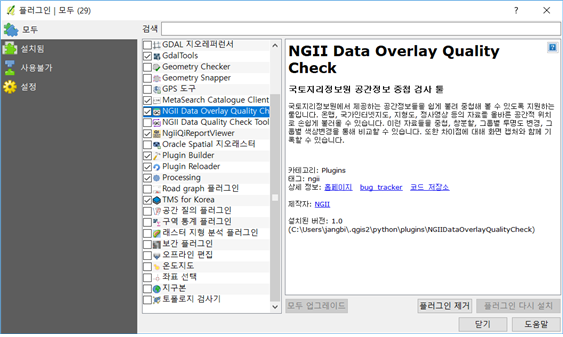

# 설치 지침서

## 국토지리정보원 공간정보 중첩 검사 툴 설치 및 시작
### 국토지리정보원 공간정보 중첩 검사 툴 설치
 국토지리정보원 공간정보 중첩 검사 툴은 QGIS 플러그인으로 만들어져 있어 QGIS가 설치되어 있고 ‘국토지리정보원 QGIS 플러그인 저장소’가 QGIS 플러그인 관리자에 등록되어 있다면 인터넷을 통해 손쉽게 설치 가능하다. QGIS 설치와 국토지리정보원 QGIS 플러그인 저장소 등록 방법은 사용자 지침서의 해당 장을 참고하시면 된다. 이 기능은 QGIS 외에도 PostgreSQL과 PostGIS를 필요로 하는데, 이 설치는 사용자 지침서의 해당 장을 참조하면 된다.

 * 플러그인을 인터넷으로 설치할 수 있는 준비가 되면 QGIS의 [플러그인 – 플러그인 관리 및 설치] 메뉴를 눌러 플러그인 관리자를 실행할 수 있다.
 * 플러그인 관리자의 상단 검색 부분에서 ‘ngii’ 로 검색하면 여러 가지 국토지리정보원을 위한 플러그인들이 보이는데, 이 중 ‘NGII Data Overlay Quality Check’가 국토지리정보원 공간정보 중첩 검사 툴 이다. 이 플러그인을 선택 후 [플러그인 설치] 버튼을 누르면 자동으로 설치된다.
