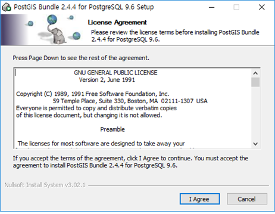

# 설치 지침서

## 필요 프로그램
 * QGIS 2.18
  - 공간정보 중첩 검사 툴은 QGIS 위에서 실행되는 플러그인이기에 QGIS를 반드시 먼저 설치해야 합니다.
  - 때문에 QGIS를 먼저 설치해야 하는데, 최신 버전이 아닌 2.18 버전을 설치해야 합니다.
 * 공간정보 중첩 검사 툴 플러그인
  - 실제 업무 기능이 들어있는 프로그램입니다.
  - QGIS에서 쉽게 설치할 수 있고 쉽게 업데이트 가능합니다.
 * PostgreSQL
  - '포스트그레스큐엘'이라 읽는 무료 DBMS 프로그램입니다.
  - 다른 기능을 쓸 때는 필요 없고 [기초자료/수정성과 비교] 기능을 사용할 때만 필요합니다.
  - 정보를 효과적으로 빠르게 처리하는데 도움을 줍니다.
 * PostGIS
  - '포스트지아이에스'라 읽는 무료 공간정보 DBMS 확장팩입니다.
  - 다른 기능을 쓸 때는 필요 없고 [기초자료/수정성과 비교] 기능을 사용할 때만 필요합니다.
  - DBMS가 공간정보를 처리할 수 있게 해 줍니다.

## QGIS 설치
### QGIS 설치 초기 화면

 * 진행 순서에 따라 [다음] 버튼을 누르며 설치를 진행한다.
 * 설정된 경로는 변경하지 않는 것을 권장한다.

 * [주의] 만약 윈도우의 사용자 이름이 ‘한글’이라면 QGIS가 실행은 되지만 정상적으로 동작하지 않는 기능이 있을 수 있고, 국토기본정보를 위한 대부분의 플러그인도 정상 동작하지 않는다.
 * 확인하는 방법은 키보드의 [윈도우키-R]을 누르면 나오는 ‘실행’창에서 cmd라 입력 후 [확인]을 누르면 나오는 까만 도스창의 C:\Users로 시작하는 부분에 한글이나 빈칸이 있는지 확인하면 된다.

 * QGIS는 무료 오픈소스 GIS 프로그램으로 기업과 개인 누구나 자유롭게 사용가능하며 다음의 경로에서도 받을 수 있다.
  https://qgis.org/ko/site/forusers/download.html

## 국토지리정보원 공간정보 중첩 검사 툴 설치
 국토지리정보원 공간정보 중첩 검사 툴은 QGIS 플러그인으로 만들어져 있어 QGIS가 설치되어 있고 ‘국토지리정보원 QGIS 플러그인 저장소’가 QGIS 플러그인 관리자에 등록되어 있다면 인터넷을 통해 손쉽게 설치 가능하다. QGIS 설치와 국토지리정보원 QGIS 플러그인 저장소 등록 방법은 사용자 지침서의 해당 장을 참고하시면 된다. 이 기능은 QGIS 외에도 PostgreSQL과 PostGIS를 필요로 하는데, 이 설치는 사용자 지침서의 해당 장을 참조하면 된다.

 * 플러그인을 인터넷으로 설치할 수 있는 준비가 되면 QGIS의 [플러그인 – 플러그인 관리 및 설치] 메뉴를 눌러 플러그인 관리자를 실행할 수 있다.
 * 플러그인 관리자의 상단 검색 부분에서 ‘ngii’ 로 검색하면 여러 가지 국토지리정보원을 위한 플러그인들이 보이는데, 이 중 ‘NGII Data Overlay Quality Check’가 국토지리정보원 공간정보 중첩 검사 툴 이다. 이 플러그인을 선택 후 [플러그인 설치] 버튼을 누르면 자동으로 설치된다.

## PostgreSQL 설치
### PostgreSQL 설치 초기 화면

 * PostgreSQL의 설치는 [다음] 버튼만 누르면 설치가 가능하다.
 * 설정된 경로는 변경하지 않는 것을 권장한다.
 * PostgreSQL의 암호를 입력하는 화면은 다음 페이지에서 설명한다.
 * PostgreSQL 설치 마지막 단계에 Stack Builder라는 확장 툴을 설치할 수 있는 옵션이 실행되는데 이 단계는 취소하고 종료하도록 한다.

### PostgreSQL 암호 입력

 * [주의] PostgreSQL 설치중 관리자 계정인 postgres 계정의 아이디를 정하고 기억해야한다. 보통 postgres라는 계정과 동일한 암호를 사용한다.- 권장 : postgres

## PostGIS 설치
### PostGIS 설치 초기 화면

 * PostGIS의 설치는 진행 순서에 따라 [다음] 버튼을 누르며 설치를 진행한다.
 * 설정된 경로는 변경하지 않는 것을 권장한다.
 * PostGIS의 암호를 입력하는 화면은 다음 페이지에서 설명한다.

### PostGIS 암호 입력

 * PostgreSQL 설치 시 지정했던 postgres 계정의 암호를 입력한다.- 권장 : postgres
