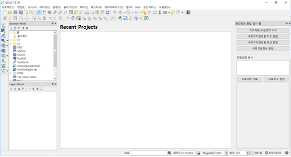
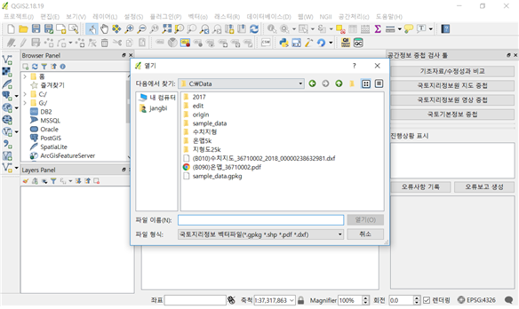

# 공간정보 중첩 검사 툴
## 공간정보 중첩 검사 툴 개요
 국토지리정보원 공간정보 중첩 검사 툴은 국토기본정보(*.gpkg), 수치지도(*.dxf), 공공측량성과(*.dxf), 항공영상(*.img), 정사영상(*.tif), 온맵(*.pdf), 국가인터넷지도 등 국토지리정보원에서 사용되고 있는 다양한 공간정보들을 손쉽게 지리적 위치에 중첩하여 비교분석 할 수 있도록 도와주는 도구다.

 

 * GIS 툴의 일반적인 기능으로도 다양한 자료들을 읽을 수 있지만, 본 공간정보 중첩 검사는 공간정보에 위치정보가 없거나 좌표계가 명확치 않은 등의 경우에도 도엽명 등을 바탕으로 각 자료를 올바른 지리적 위치에 올바른 좌표계로 불러올 수 있어 사용자가 어려워하는 좌표계 관련 지식이 없는 사용자도 쉽게 여러 형식의 자료를 다룰 수 있다.
 * 두 공간자료 세트 간의 변화를 자동탐지하여 신규/도형수정/속성수정/삭제로 구분하는 기능도 있고, 여러 레이어로 구성된 자료들을 그룹으로 묶어 한 번에 관리할 수 있도록 해주고, 각 자료의 투명도를 그룹 단위로 조정하거나, 색을 변경하고, 필요시 분할 창으로 띄워 자료의 공간적 위치를 동일하게 연결하는 등 하여 자료를 쉽게 비교분석 가능하게 도와주는 다양한 기능을 제공해 준다.

## 국토지리정보원 공간정보 중첩 검사 툴 설치 및 시작
### 국토지리정보원 공간정보 중첩 검사 툴 설치
 국토지리정보원 공간정보 중첩 검사 툴은 QGIS 플러그인으로 만들어져 있어 QGIS가 설치되어 있고 ‘국토지리정보원 QGIS 플러그인 저장소’가 QGIS 플러그인 관리자에 등록되어 있다면 인터넷을 통해 손쉽게 설치 가능하다. QGIS 설치와 국토지리정보원 QGIS 플러그인 저장소 등록 방법은 사용자 지침서의 해당 장을 참고하시면 된다. 이 기능은 QGIS 외에도 PostgreSQL과 PostGIS를 필요로 하는데, 이 설치는 사용자 지침서의 해당 장을 참조하면 된다.

 * 플러그인을 인터넷으로 설치할 수 있는 준비가 되면 QGIS의 [플러그인 – 플러그인 관리 및 설치] 메뉴를 눌러 플러그인 관리자를 실행할 수 있다.
 * 플러그인 관리자의 상단 검색 부분에서 ‘ngii’ 로 검색하면 여러 가지 국토지리정보원을 위한 플러그인들이 보이는데, 이 중 ‘NGII Data Overlay Quality Check’가 국토지리정보원 공간정보 중첩 검사 툴 이다. 이 플러그인을 선택 후 [플러그인 설치] 버튼을 누르면 자동으로 설치된다.

### 공간정보 중첩 검사 기능 실행
 공간정보 중첩 검사 툴인 NGII Data Overlay Quality Check 플러그인을 설치하며 QGIS의 툴바에 원통모양의 QC라 쓰인 아이콘이 생긴다.

 * [QC] 아이콘을 클릭하면 QGIS의 화면 오른쪽에 여러 가지 공간정보를 중첩할 수 있는 기능들이 생긴다. 또한 메뉴의 NGII에서도 국토지리정보원 공간정보 중첩검사를 찾을 수 있는 데 이 메뉴도 아이콘과 동일하게 동작한다. 아이콘과 메뉴는 모두 한 번 실행하면 QGIS 오른쪽의 도구들이 있는 창이 생기고, 다시 한 번 실행하면 도구들이 없어지게 된다. 

## 기초자료/수정성과 비교 기능
### 기초자료/수정성과 비교 개요
 이 기능은 한 쌍의 기초자료(수주시 국토지리정보원에서 받은 지도자료)와 수정성과(지도업체가 기초자료를 현황에 맞게 수정한 지도자료) 간의 변화내용을 자동으로 비교해 변화내용을 코드로 부여하고 보여주는 기능이다. 자동으로 선택한 데이터의 쌍을 비교하여 각 객체를 유지/신규/삭제/속성수정/도형수정으로 구분해 준다.
 유지는 두 데이터 세트에 동일한 위치에 동일한 객체가 있는 경우이고, 신규는 공간적/속성적으로 연결되지 않는 객체이며, 삭제는 과거 데이터에는 있었으나 신규 데이터에서는 존재하지 않는 경우이며, 속성수정은 공간적 위치와 도형을 구성하는 모든 점은 일치하지만 속성이 틀려진 경우이며, 도형수정은 키 필드를 포함한 모든 속성 값들이 동일한 객체가 다른 곳에서 발견된 경우다.
 데이터 비교는 ESRI Shape(*.shp) 파일들이나 GeoPackage(*.gpkg) 파일을 선택하면 자동으로 진행된다.

### 기초자료/수정성과 비교 기능 실행

 
  
 * 이 기능 실행을 위해서는 ‘국토기본정보 공간정보 중첩 검사’ 툴에 있는 [기초자료/수정성과 비교] 버튼을 누르면 된다.
  처음 실행하는 경우 PostgreSQL에 접속할 수 있는 DB 접속정보를 물어보게 된다.    만일 사용자 지침서의 PostgreSQL 설치 부분의 DB 접속정보를 그대로 따랐다면 [저장]만 누르면 되고, 달리 했다면 설정한 정보를 입력하면 된다.

 * 정상적으로 DB에 접속되면 비교대상 공간자료를 선택하는 창이 나온다. 기초자료는 사업자가 국토지리정보원에서 받아간 수정 전 국토기본정보 자료를 의미하고, 수정성과 자료는 DB 사업자가 수정한 국토기본정보 자료를 의미한다. 기초자료/수정성과 비교는 이 한 쌍의 자료의 도형과 속성을 비교하여 유지/신규/삭제/속성수정/도형수정으로 판단해 준다.

### 기초자료/수정성과 비교 결과
 기초자료/수정성과 비교 결과 실행화면이다.

 

 * 분석이 끝나면 탐지된 결과가 각 레이별로 분리되어 보이게 된다.색상의 의미는 아래와 같다.- 회색: 유지된 객체- 녹색: 추가된 객체- 붉은색: 삭제된 객체- 노란색: 도형변경 객체- 파란색: 속성변경 객체

## 국토지리정보원 지도 중첩 기능
### 국토지리정보원 지도 중첩 개요
 이 기능은 국토지리정보원에서 사용 중인 여러 종류의 벡터자료를 불러올 수 있는 기능이다. 지원되는 형식은 GeoPackage(*.gpkg), ESRI Shape(*.shp), 온맵(*.pdf), CAD 교환포맷(*.dxf)이다. 지형도와 공공측량성과는 모두 dxf 형태로 되어 있으며, 포함된 모든 레이어가 불러와 진다.
  GIS 툴에 있는 일반적인 벡터 데이터 불러오기 기능과 본 툴의 기능의 중요한 차이점은 좌표계나 실제 위치가 없는 자료인 경우에도 파일이름에 포함된 도엽명을 기준으로 해석해, 자동으로 실제 지리적 위치에 정확한 좌표계로 자료를 불러오기에 다른 자료들과 정확한 중첩이 가능하다는 것이다. 특히 온맵 PDF의 경우 보안 규정상 실제 위치정보를 포함하지 않는 형태의 인쇄용 PDF로 만들어 배포되지만, 본 툴에서는 PDF의 정보를 해석하여 포함된 벡터정보와 정사영상까지 같이 불러온다.
  또한 한 자료에 여러 레이어가 있는 경우나 CAD 교환포맷(DXF)처럼 점, 선, 면이 섞여 있는 경우 이를 그룹화 하여, 동시에 투명도를 조절하거나 색을 변경하고 분할 창 이동, 제거 등의 동작을 수행할 수 있도록 해준다.

### 국토지리정보원 지도 중첩 기능 실행
 이 기능 실행을 위해서는 ‘국토기본정보 공간정보 중첩 검사’ 툴에 있는 [국토지리정보원 지도 중첩] 버튼을 누르면 된다. 허용하는 벡터자료 종류를 여러 가지 선택할 수도 있다. 
  
 

### 국토지리정보원 지도 중첩 기능 실행
  국토지리정보원 지도 중첩 기능 실행 결과 화면이다.

 

 * 여러 벡터파일과 정사영상이 같이 들어있는 자료인 온맵(PDF)파일의 예를 들면, PDF 파일에 들어있던 레이어 중 지도부분에 해당되는 자료들이 그룹화 되어 불러와 지고, 각 그룹 안에 점, 선, 면으로 분리된 레이어들이 들어가게 구성되어 불러와 진다. 또 PDF에 포함되어 있던 정사영상까지 불러와진다.
 * 이 때 국가인터넷지도 등 다른 공간정보를 참조자료로 불러와 보면 이 자료들이 정확히 해석되어 올바른 지리적 위치에 들어와 있음을 알 수 있다.

## 국토지리정보원 영상 중첩 기능
### 국토지리정보원 영상 중첩 개요
 이 기능은 국토지리정보원에서 사용 중인 여러 종류의 래스터자료를 불러올 수 있는 기능이다. 지원되는 형식은 GeoTIFF(*.tif), Erdas Imagine(*.img) 포맷이다.
  GIS 툴에 있는 일반적인 래스터 데이터 불러오기 기능과 본 툴의 기능의 중요한 차이점은 좌표계나 실제 위치가 없는 자료인 경우에도 파일이름에 포함된 도엽명을 기준으로 해석해, 자동으로 실제 지리적 위치에 정확한 좌표계로 자료를 불러오기에 다른 자료들과 정확한 중첩이 가능하다는 것이다. 특히 TIF 파일의 경우 보안 규정상 실제 위치정보를 포함하지 않는 형태로 배포되지만, 본 툴에서는 도엽명을 기준으로 위치와 좌표계를 자동 판단하여 불러와 진다.
  또한 이 래스터 자료들도 투명도를 조절하거나, 분할 창 이동, 제거 등의 동작을 수행할 수 있도록 해준다.

### 기능 실행
 이 기능 실행을 위해서는 ‘국토기본정보 공간정보 중첩 검사’ 툴에 있는 [국토지리정보원 영상 중첩] 버튼을 누르면 된다. 
 

### 국토지리정보원 영상 중첩 결과
 사용자가 선택한 영상은 정확한 좌표계 정보가 있는 경우 그대로 불러와 지지만, 좌표계 정보나 위치정보가 없는 영상인 경우 도엽명을 바탕으로 위치를 해석하여 정확한 지리적 위치에 불러와 진다. 주변에 참조할 수 있는 공간정보가 있는 경우 정확한 위치정보를 확인할 수 있다.

## 국토기본정보 중첩 기능
###  국토기본정보 중첩 개요
 본 기능은 국토지리정보원 내부에 취합되고 있는 국토기본정보를 중첩해 볼 수 있는 기능이다. 국토기본정보를 구성하고 있는 전 레이어를 불러올 수도 있고, 각 자료를 구성하는데 필요한 레이어를 선택하여 불러올 수도 있다. 하지만, 지나치게 넓은 범위에서 자료를 보려고 하는 경우 성능저하 방지를 위해 레이어별 최소 축척보다 작은 경우 자동으로 불러오지 않게 설정되어 있다.

### 국토기본정보 중첩 기능 실행
 이 기능 실행을 위해서는 ‘국토기본정보 공간정보 중첩 검사’ 툴에 있는 [국토기본정보 중첩] 버튼을 선택하면 된다.

### 국토기본정보 중첩 결과
 사용자가 선택한 국토기본정보는 레이어와 주요 속성을 바탕으로 정해진 심벌로 표현되어 불러와 진다.

 

## 분할창으로 띄우기/제거
### 분할창으로 띄우기/제거 개요
 본 기능은 선택한 자료를 분할창으로 이동시켜 두 창의 위치를 연동함으로 자료의 정합성을 살펴볼 수 있는 기능이다.

### 분할창으로 띄우기/제거 기능 실행
 이 기능 실행을 위해서는 중첩을 위한 데이터를 불러올 때마다 ‘국토기본정보 공간정보 중첩 검사’ 툴 하단에 생기는 각 레이어별 조절창의 [분할창으로 이동] 버튼을 누르거나 [제거] 버튼을 누르면 된다

### 분할창으로 띄우기/제거 결과
 자료를 분할창으로 띄우면 분할창이 생기면서 그 창에 선택 자료가 들어가게 된다. 이 분할창은 주창의 영역을 이동하거나 확대/축소하면 동일한 위치로 자동으로 이동하게 된다. 하지만, 분할창에서 영역을 이동하면 주창은 변화하지 않는다.

## 투명도 조정
### 투명도 조정 개요
 본 투명도 조정 기능은 여러 레이어로 구성된 자료들을 한꺼번에 투명도를 동일하게 조정하여 동일 위치에 중첩된 자료를 쉽게 비교할 수 있도록 해주는 기능이다. QGIS의 기본 투명도 조정 기능은 여러 레이어로 구성된 자료의 경우 매우 적용하기 번거롭다.

### 투명도 조정 기능 실행
 이 기능 실행을 위해서는 중첩을 위한 데이터를 불러올 때마다 ‘국토기본정보 공간정보 중첩 검사’ 툴 하단에 생기는 각 레이어별 조정창의 투명도 슬라이더를 이동하기만 하면 된다.

### 투명도 조정 결과
 투명도 슬라이더를 이동하면 그룹으로 묶여 있는 자료의 투명도가 동시에 변경되는 것을 볼 수 있다. 특히 온맵의 경우 원 자료에 있던 벡터 데이터와 정사영상이 동시에 투명도가 조정된다. 

 

## 색상 변경
### 색상 변경 개요
  색상변경은 그룹으로 묶어진 자료 전체의 색상을 동일하게 변경하는 기능으로 중첩된 자료들을 좀 더 명확히 구분하고자 할 때 사용한다.

### 색상 변경 기능 실행
 이 기능 실행을 위해서는 중첩을 위한 데이터를 불러올 때마다 ‘국토기본정보 공간정보 중첩 검사’ 툴 하단에 생기는 각 레이어별 조절창의 [색상] 버튼을 누르거나 [제거] 버튼을 누르면 된다. 이 색상 버튼은 현재 적용된 색이 없는 경우 검은색으로, 사용자가 색을 선택한 경우 해당 색으로 표시된다.
  이 버튼을 누르면 색을 선택할 수 있는 창이 뜨고 여기서 사용자가 원하는 색을 적절히 선택하면 된다.

 

### 색상 변경 결과
 색상을 변경하면 해당 자료에 속한 모든 레이어가 사용자가 선택한 동일한 색으로 변경된다.

